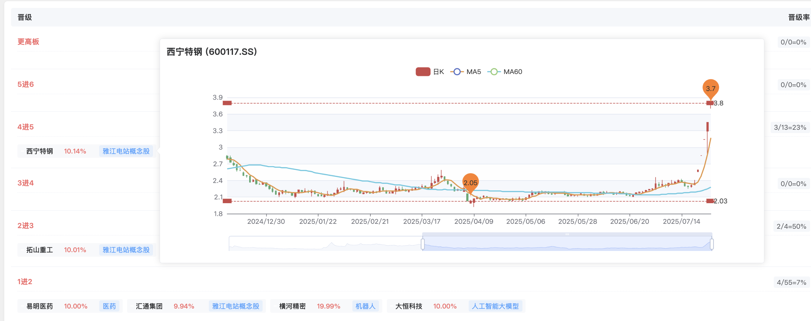
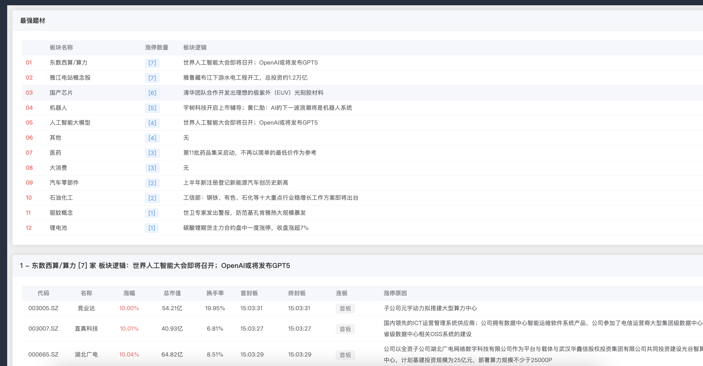

### 大A股票\板块跟踪

##### 涨停梯队
1. 展示当天涨停梯队股票，板块分类
2. 电脑打开当前网页，可实时查看当前股票K线，是否突破板，底部反转板一目了然


##### 最强题材
1. 根据当天涨停股票分类，统计各个概念板块涨停强度

##### 涨停池
1. 展示当天所有涨停的股票

##### 投资日历
1. 展示最近一些大会活动相关信息

##### 热门板块
1. 展示最近10天版本强度趋势
![热门板块(./Images/3.png)


### 本地运行
默认任务下载此项目的老师已经熟悉Vue JS相关的一些基本知识，Vue JS相关的不在此介绍
```Ruby
1. 
cd web
npm install

2.
cd ../
node main.js

3.
打开 http://localhost:8233/

```

### 数据
本网页数据来源 同花顺、开盘啦、选股通，感谢以上公司提供如此优秀的数据服务，本网站禁止商用


### 备注
如果您有好的思路欢迎一起学习探讨，早日脱离苦海
wx: Wade-Well
邮箱: wendy.yang1009@gmail.com


### 许可证
本项目采用MIT许可证 - 详情请见LICENSE文件。

